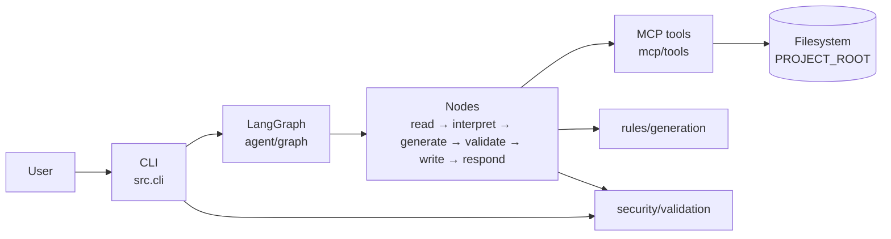

# Documentação técnica — Frontend Mocks Generator

Este documento descreve a arquitetura **implementada** após T0–T8 (código em `src/`). O produto funcional está especificado em [SPEC.md](SPEC.md). O plano de implementação por etapas está em [tasks/README.md](tasks/README.md).

---

## 1. Visão da arquitetura

O usuário invoca a CLI com um path `.ts`. A CLI valida a entrada, carrega variáveis de ambiente e executa o grafo LangGraph. Os nós avançam o estado compartilhado; leitura e escrita passam pelas tools MCP (camada de filesystem sandboxed). Em falha, o grafo encurta para o nó `respond`.



### Fluxo feliz

```
START → read → interpret → generate → validate → write → respond → END
```
### Short-circuit de erro

Após `read`, `interpret`, `generate` e `validate`, se `status == "error"` ou `errors` não estiver vazio, o grafo vai direto para `respond` (sem geração/escrita posteriores). `write` sempre segue para `respond`. Exceções não previstas em `run_agent` viram a mensagem de erro interno da SPEC §13.

---

## 2. Responsabilidade dos módulos

| Módulo | Path | Responsabilidade |
| --- | --- | --- |
| **CLI** | `src/cli.py` | Parse de args, `load_dotenv`, validação antecipada de path/tamanho, chamada a `run_agent`, impressão de `message` e exit code |
| **Grafo** | `src/agent/graph.py` | Compila o `StateGraph`, roteamento condicional e `run_agent(input_path)` |
| **Estado** | `src/agent/state.py` | Schema `MockAgentState` e `initial_state` |
| **Nó read** | `src/agent/nodes/read.py` | Valida entrada e lê o `.ts` via MCP → `source_code` |
| **Nó interpret** | `src/agent/nodes/interpret.py` | LLM (`ChatGoogleGenerativeAI` / Gemini) extrai models exportados → `parsed_model`; prompt em `docs/prompts/interpret.md` |
| **Nó generate** | `src/agent/nodes/generate.py` | Aplica regras de `rules/` → `generated_mock` + `output_path` |
| **Nó validate** | `src/agent/nodes/validate.py` | Checagens estruturais do mock (export, props do modelo, etc.) |
| **Nó write** | `src/agent/nodes/write.py` | Persiste via MCP com `overwrite=False` (RN03) |
| **Nó respond** | `src/agent/nodes/respond.py` | Monta `message` final de sucesso ou erro |
| **MCP client** | `src/mcp/client.py` | `FilesystemMCPClient`: contrato filesystem (read/write/exists) sob `PROJECT_ROOT` |
| **MCP tools** | `src/mcp/tools.py` | API de alto nível `read_file` / `write_file` / `file_exists` com sandbox e só `.ts` |
| **Regras** | `src/rules/generation.py` | Heurísticas de valores (SPEC §11), nomes `entity.mock.ts` / `entityMock`, composição do fonte |
| **Segurança** | `src/security/validation.py` | Path dentro do root, tamanho, extensão `.ts`, mensagens EXATAS da SPEC §13 |

### Nota sobre MCP (v1)

Nesta versão, o “MCP de filesystem” é uma **abstração in-process** (`FilesystemMCPClient` + tools), não um servidor MCP externo separado. Toda I/O do agente ainda passa por essa camada (RNF03), com sandbox em `PROJECT_ROOT`.

---

## 3. Estado compartilhado (`MockAgentState`)

Definido em `src/agent/state.py`. Os nós retornam updates parciais; o LangGraph faz o merge. `errors` e `warnings` usam reducer `operator.add` (acumulam).

| Campo | Tipo | Papel |
| --- | --- | --- |
| `input_path` | `str` | Path do `.ts` de entrada |
| `source_code` | `str` | Conteúdo lido via MCP |
| `parsed_model` | `dict` | Model interpretado (`name`, `kind`, `properties`, `enum_values`, `nested` / `models`) |
| `generated_mock` | `str` | Fonte TypeScript do mock |
| `output_path` | `str` | Destino sob `MOCKS_OUTPUT_DIR` |
| `errors` | `list[str]` | Mensagens de erro acumuladas |
| `warnings` | `list[str]` | Avisos não fatais (ex.: arquivo já existe) |
| `status` | `"pending"` \| `"running"` \| `"success"` \| `"error"` | Fase do fluxo |
| `message` | `str` | Texto final ao usuário |

---

## 4. Variáveis de ambiente

Fonte: `.env.example` / `.env` (carregadas com `python-dotenv`). **Nunca** commitar secrets.

| Variável | Default | Uso |
| --- | --- | --- |
| `GOOGLE_API_KEY` | _(obrigatória)_ | Autenticação da LLM Gemini no nó `interpret` (`GEMINI_API_KEY` também aceita) |
| `GEMINI_MODEL` | `gemini-2.0-flash` | Nome do modelo Gemini (opcional) |
| `PROJECT_ROOT` | `.` | Raiz do sandbox de leitura/escrita |
| `MOCKS_OUTPUT_DIR` | `examples/mocks` | Diretório dos mocks gerados (relativo ao root se não absoluto) |
| `MAX_FILE_SIZE_BYTES` | `100000` | Limite de tamanho de arquivo/conteúdo |

---

## 5. Estrutura do repositório (v1)

```
src/
  agent/
    graph.py
    state.py
    nodes/          # read, interpret, generate, validate, write, respond
  mcp/
    client.py
    tools.py
  rules/
    generation.py
  security/
    validation.py
  cli.py
examples/
  types/            # modelos de exemplo (User.ts, …)
  mocks/            # saída gerada
docs/
  SPEC.md
  TECHNICAL.md
  prompts/          # prompts de runtime (interpret.md)
  tasks/
.env.example
README.md
pyproject.toml
requirements.txt
```

---

## 6. Limitações da v1

Alinhado à SPEC §3 (Fora do Escopo) e §16 (Possíveis Evoluções). **Não** fazem parte desta versão:

- factories, Faker, Storybook, MSW, Prisma, Zod, Swagger/OpenAPI, fixtures Cypress;
- geração de testes automatizados ou APIs;
- servidor MCP externo / multi-projeto;
- personalização avançada das regras além de `src/rules/generation.py`.

A geração de valores é heurística determinística (nome/tipo da propriedade), com interpretação estrutural via LLM — não é um gerador estatístico de dados “realistas” genérico.

---

## 7. Status dos critérios de aceite (SPEC §15)

Espelho do checklist da SPEC, refletindo o código após T0–T8 e a documentação desta etapa (T9).

| Critério | Status | Notas |
| --- | --- | --- |
| Fluxo completo com LangGraph | Atendido | `build_graph` / `run_agent` em `src/agent/graph.py` |
| Leitura do arquivo via MCP | Atendido* | Via `mcp/tools.read_file` + `FilesystemMCPClient` (abstração in-process; ver §2) |
| Mock gerado corretamente | Atendido | Regras §11 + exemplos em `examples/` |
| Arquivo salvo automaticamente | Atendido | Nó `write` → `MOCKS_OUTPUT_DIR` |
| Estado compartilhado entre nós | Atendido | `MockAgentState` |
| Erros tratados | Atendido | Mensagens SPEC §13 + short-circuit |
| Documentação completa | Atendido | `SPEC.md`, este arquivo, `README.md`, `docs/tasks/` |
| Publicado no GitHub | Pendente | Remote `origin` existe (`vhasckel/frontend-mocks-generator`); falta push de `main` com T8+T9 |

\*Aceito na v1 conforme implementação documentada; evolução natural seria conectar um servidor MCP real.
