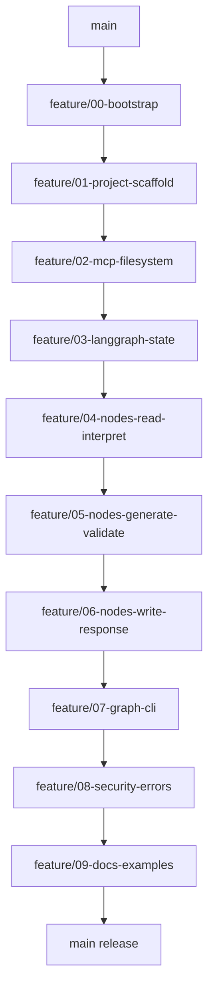

# Fluxo de tarefas — Frontend Mocks Generator

Índice operacional para implementar o agente descrito em [docs/SPEC.md](../SPEC.md).

Cada etapa tem um arquivo `NN-*.md` com **objetivo**, **branch**, **dependência**, **arquivos esperados**, **critérios de aceite**, **commits sugeridos** e um **prompt colável** para o Cursor Agent.

## Regras

- Uma branch = uma tarefa = um PR linear, mergeado em `main` antes da próxima etapa.
- Commits pequenos e por intenção (`feat:`, `fix:`, `docs:`, `chore:`).
- Implementar **somente** o escopo da etapa; não antecipar código das etapas seguintes.
- Seguir a SPEC (RF / RN / RNF citados em cada tarefa).
- Preferir um chat Cursor por tarefa (contexto limpo + prompt autocontido).

## Mapa de branches

| Etapa | Branch | Depende de | Arquivo |
| --- | --- | --- | --- |
| T0 | `feature/00-bootstrap` | `main` | [00-bootstrap.md](00-bootstrap.md) |
| T1 | `feature/01-project-scaffold` | T0 em `main` | [01-project-scaffold.md](01-project-scaffold.md) |
| T2 | `feature/02-mcp-filesystem` | T1 em `main` | [02-mcp-filesystem.md](02-mcp-filesystem.md) |
| T3 | `feature/03-langgraph-state` | T2 em `main` | [03-langgraph-state.md](03-langgraph-state.md) |
| T4 | `feature/04-nodes-read-interpret` | T3 em `main` | [04-nodes-read-interpret.md](04-nodes-read-interpret.md) |
| T5 | `feature/05-nodes-generate-validate` | T4 em `main` | [05-nodes-generate-validate.md](05-nodes-generate-validate.md) |
| T6 | `feature/06-nodes-write-response` | T5 em `main` | [06-nodes-write-response.md](06-nodes-write-response.md) |
| T7 | `feature/07-graph-cli` | T6 em `main` | [07-graph-cli.md](07-graph-cli.md) |
| T8 | `feature/08-security-errors` | T7 em `main` | [08-security-errors.md](08-security-errors.md) |
| T9 | `feature/09-docs-examples` | T8 em `main` | [09-docs-examples.md](09-docs-examples.md) |



## Estrutura de código alvo

Ao final de T0–T9, o repositório deve conter:

```
src/
  agent/
    graph.py
    state.py
    nodes/
      read.py
      interpret.py
      generate.py
      validate.py
      write.py
      respond.py
  mcp/
    client.py
    tools.py
  rules/
    generation.py
  security/
    validation.py
  cli.py
examples/
  types/User.ts
  mocks/
docs/
  SPEC.md
  tasks/
  TECHNICAL.md
.env.example
README.md
pyproject.toml
requirements.txt
```

## Como executar (passo a passo)

1. Abra um chat novo no Cursor Agent.
2. Abra o arquivo da etapa atual em `docs/tasks/` e **cole o bloco Prompt** na íntegra.
3. Revise o diff, rode a validação manual indicada na tarefa e peça o commit (se o agente ainda não tiver commitado conforme o prompt).
4. Abra PR (ou merge local) da branch da etapa em `main`.
5. Em `main`: `git checkout main && git pull` (se houver remote).
6. Só então avance para a próxima etapa.

### Ordem e marcos

1. **T0** — bootstrap do repositório e índice de tarefas.
2. **T1** — scaffold Python + deps. Depois: copiar `.env.example` → `.env` e preencher `OPENAI_API_KEY`.
3. **T2 → T6** — MCP, estado LangGraph e nós do fluxo.
4. **T7** — grafo + CLI. Smoke test:
   ```bash
   python -m src.cli examples/types/User.ts
   ```
   Conferir mock gerado em `examples/mocks/` (ou caminho configurado).
5. **T8** — segurança e mensagens de erro da SPEC (seção 13).
6. **T9** — documentação técnica, README de uso e checklist da seção 15 da SPEC. Publicar no GitHub se ainda não estiver.

### Checklist de aceite final (SPEC §15)

Espelho vivo em [SPEC.md §15](../SPEC.md#15-critérios-de-aceite) e [TECHNICAL.md §7](../TECHNICAL.md#7-status-dos-critérios-de-aceite-spec-15).

- [x] O agente executa o fluxo completo com LangGraph
- [x] A leitura do arquivo ocorre via MCP
- [x] O mock é gerado corretamente
- [x] O arquivo é salvo automaticamente
- [x] O estado é compartilhado entre os nós
- [x] Os erros são tratados
- [x] A documentação está completa
- [ ] O projeto está publicado no GitHub

## Contrato dos prompts

Todo prompt instrui o agente a:

1. Partir da base correta e criar a branch da etapa
2. Implementar somente o escopo da etapa
3. Seguir [docs/SPEC.md](../SPEC.md)
4. Criar os commits listados (mensagens literais)
5. Ao final: resumir arquivos alterados + como validar manualmente
